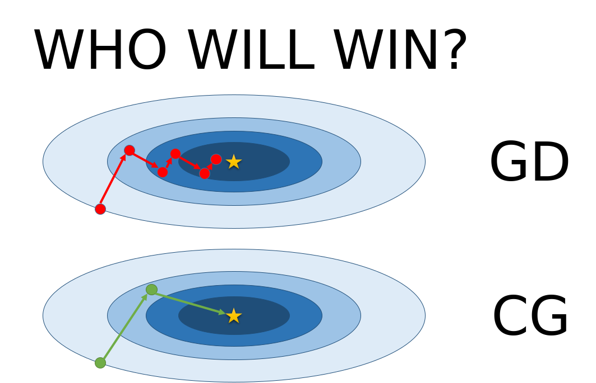
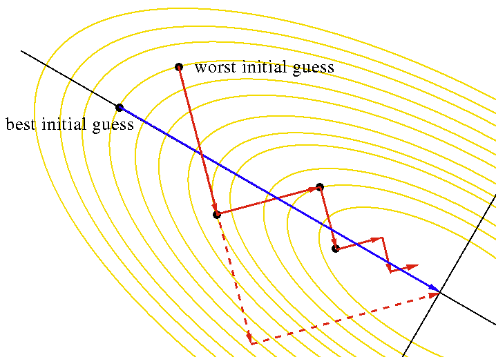
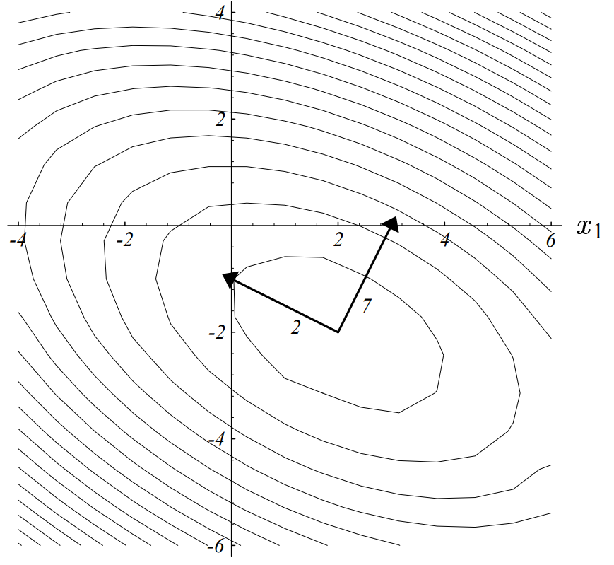

# Introduction

Originally, the conjugate gradients method  was created to solve a system of linear equations. 

$$
Ax = b
$$

Without special efforts the problem can be presented in the form of minimization of the quadratic function, and then generalized on a case of *non* quadratic function. We will start with the parabolic case and try to construct a  conjugate gradients method for it.
Let us consider the classical problem of minimization of the quadratic function:

$$
f(x) = \frac{1}{2}x^\top A x - b^\top x + c \to \min\limits_{x \in \mathbb{R}^n }
$$

Here $$x \in \mathbb{R}^n, A \in \mathbb{R}^{n \times n}$$, $$b \in \mathbb{R}^n, c \in \mathbb{R}$$.

# Method of conjugate gradients for the quadratic function

We will consider symmetric matrices $$A \in \mathbb{S}^n$$ (otherwise, replacing $$A' = \frac{A + A^\top}{2}$$ leads to the same optimization problem). Then:

$$
\nabla f = Ax - b
$$

Then having an initial guess $$x_0$$, vector $$d_0 = -\nabla f(x_0)$$ is the direction of the fastest decrease. The procedure of the steepest descent in this direction is provided by the procedure of line search:

$$
\begin{align*}
g(\alpha) &= f(x_0 + \alpha d_0) \\
          &= \frac{1}{2}(x_0 + \alpha d_0)^\top A (x_0 + \alpha d_0) - b^\top (x_0 + \alpha d_0) + c\\
          &= \frac{1}{2}\alpha^2 {d_0}^\top A d_0 + {d_0}^\top (A x_0 - b) \alpha + (\frac{1}{2} {x_0}^\top A x_0 + {x_0}^\top d_0 + c)
\end{align*}
$$

Assuming that the point of the zero derivative in this parabola is the minimum (for positive matrices it is guaranteed, otherwise it is not a fact), and also, rewriting this problem for the arbitrary ($$k$$) direction of the method, we have:

$$
g'(\alpha_k) = (d_k^\top A d_k)\alpha_k + d_k^\top(A x_k - b) = 0
$$

$$
\alpha_k = -\frac{d_k^\top (A x_k - b)}{d_k^\top A d_k} = \dfrac{d_k^\top d_k}{d_k^\top A d_k}.
$$

Then let's start our method, as the method of the steepest descent:

$$
x_1 = x_0 - \alpha_0 \nabla f(x_0)
$$

Note, however, that if the next step is built in the same way (the fastest descent), we will "lose" some of the work that was done in the first step and we will get a classic situation for the fastest descent:

In order to avoid this, we introduce the concept of $$A$$-conjugate vectors: let's say that two vectors $$x$$, $$y$$ are $$A$$-conjugate relative to each other if they are executed:

$$
x^\top A y = 0
$$

This concept becomes particularly interesting when matrix $$A$$ is positive defined, then $$x,y$$ vectors will be orthogonal if the scalar product is defined by the matrix $$A$$. Therefore, this property is also called $$A$$ - orthogonality.

Then we will build the method in such a way that the next direction is $$A$$ - orthogonal with the previous one:

$$
d_1 = -\nabla f(x_1) + \beta_0 d_0,
$$

where $$\beta_0$$ is selected in a way that $$d_1 \perp_A d_0$$:

$$
d_1^\top A d_0 = -\nabla f(x_1)^\top Ad_0 + \beta_0 d_0^\top A d_0 = 0
$$

$$
\beta_0 = \frac{\nabla f(x_1)^\top A d_0}{d_0^\top A d_0}
$$

It's interesting that all received $$A$$ directions are $$A$$- orthogonal to each other. (proved by induction) 

Thus, we formulate an algorithm:

1. Let $$k = 0$$ and $$x_k = x_0$$, count $$d_k = d_0 = -\nabla f(x_0)$$.

2. By the procedure of line search we find the optimal length of step: 

  Calculate $$\alpha$$ minimizing $$f(x_k + \alpha_k d_k)$$ by the formula

  $$
  \alpha_k = -\frac{d_k^\top (A x_k - b)}{d_k^\top A d_k}
  $$

3. We're doing an algorithm step:

  $$
  x_{k+1} = x_k + \alpha_k d_k
  $$

4. update the direction: $$d_{k+1} = -\nabla f(x_{k+1}) + \beta_k d_k$$, where $$\beta_k$$ is calculated by the formula:

  $$
  \beta_k = \frac{\nabla f(x_{k+1})^\top A d_k}{d_k^\top A d_k}.
  $$

5. Repeat steps 2-4 until $$n$$ directions are built, where $$n$$ is the dimension of space (dimension of $$x$$).

# Method of conjugate gradients for non-quadratic function:

In case we do not have an analytic expression for a function or its gradient, we will most likely not be able to solve the one-dimensional minimization problem analytically. Therefore, step 2 of the algorithm is replaced by the usual line search procedure. But there is the following mathematical trick for the fourth point:

For two iterations, it is fair:

$$
x_{k+1} - x_k = c d_k,
$$

where $$c$$ is some kind of constant. Then for the quadratic case, we have:

$$ 
\nabla f(x_{k+1}) - \nabla f(x_k) = (A x_{k+1} - b) - (A x_k - b) = A(x_{k+1}-x_k) = cA d_k
$$

Expressing from this equation the work $$Ad_k = \dfrac{1}{c} \left( \nabla f(x_{k+1}) - \nabla f(x_k)\right)$$, we get rid of the "knowledge" of the function in step definition $$\beta_k$$, then point 4 will be rewritten as:

$$
\beta_k = \frac{\nabla f(x_{k+1})^\top (\nabla f(x_{k+1}) - \nabla f(x_k))}{d_k^\top (\nabla f(x_{k+1}) - \nabla f(x_k))}.
$$

This method is called the Polack - Ribier method.

# Examples
## Example 1
Prove that if a set of vectors $$d_1, \ldots, d_k$$ - are $$A$$-conjugate (each pair of vectors is $$A$$-conjugate), these vectors are linearly independent. $$A \in \mathbb{S}^n_{++}$$.

Solution:

  We'll show, that if $$\sum\limits_{i=1}^k\alpha_k d_k = 0$$, than all coefficients should be equal to zero:

  $$
  \begin{align*}
  0 &= \sum\limits_{i=1}^n\alpha_k d_k \\
    &= d_j^\top A \left( \sum\limits_{i=1}^n\alpha_k d_k \right) \\
    &=  \sum\limits_{i=1}^n \alpha_k d_j^\top A d_k  \\
    &=  \alpha_j d_j^\top A d_j  + 0 + \ldots + 0\\
  \end{align*}
  $$

  Thus, $$\alpha_j = 0$$, for all other indices one have perform the same process

# References
* [An Introduction](https://www.cs.cmu.edu/~quake-papers/painless-conjugate-gradient.pdf)  to the Conjugate Gradient Method Without the Agonizing Pain
* [The Concept of Conjugate Gradient Descent in Python](https://ikuz.eu/machine-learning-and-computer-science/the-concept-of-conjugate-gradient-descent-in-python/) by Ilya Kuzovkin
* [Picture of best\worst initial guess in SD](http://fourier.eng.hmc.edu/e176/lectures/)

# Code
[Open In Colab](https://colab.research.google.com/github/MerkulovDaniil/optim/blob/master/assets/Notebooks/CG.ipynb){: .btn }
