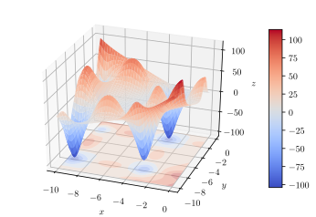
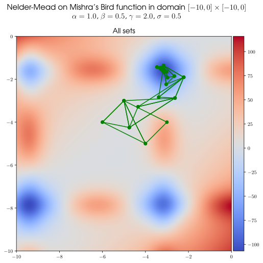
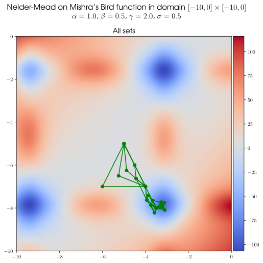
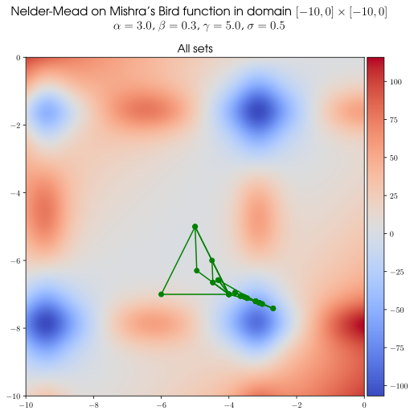
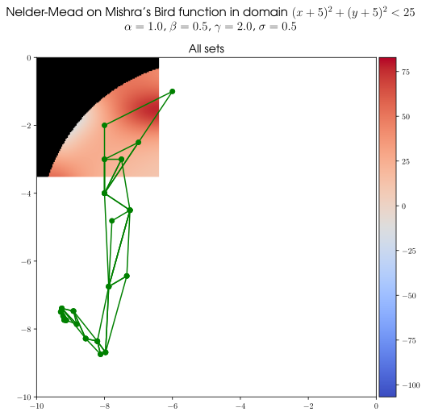

# Problem

Sometimes the multidimensional function is so difficult to evaluate that even expressing the $$1^{\text{st}}$$ derivative for gradient-based methods of finding optimum becomes an impossible task.
In this case, we can only rely on the values of the function at each point. Or, in other words, on the $$0$$ order oracle calls.

Let's take, for instance, Mishra's Bird function:

$$
f(x,y) = \sin{y} \cdot e^{\left( 1 - \cos{x} \right)^2} + \cos{x} \cdot e^{\left( 1 - \sin{y} \right)^2} + (x - y)^2
$$

This function is usually subjected to the domain $$(x+5)^2 + (y+5)^2 < 25$$, but for the sake of picture beauty we will mainly use domain $$[-10; 0] \times [-10; 0]$$.

# Algorithm

## Related definitions:

* $$\textbf{Simplex}$$ -- polytope with the least possible number of vertices in $$n$$-dimensional space. (So, it's $$(n+1)$$-polytope.) In our $$2D$$ case it will be triangle.
* $$\textbf{Best point }x_1$$ -- vertex of the simplex, function value in which is the smallest among all vertices.
* $$\textbf{Worst point }x_{n+1}$$ -- vertex of the simplex, function value in which is the largest among all vertices.
* $$\textbf{Other points }x_2, \ldots, x_n$$ -- vertices of the simplex, ordered in such way that $$f(x_1) \leqslant f(x_2) \leqslant \ldots \leqslant f(x_n) \leqslant f(x_{n+1})$$.
This implies that $$\{ x_1, x_2, \ldots, x_n \}$$ are best points in relation to $$x_{n+1}$$ and $$\{ x_2, \ldots, x_n, x_{n+1} \}$$ are worst points in relation to $$x_1$$.
* $$\textbf{Centroid }x_o$$ -- center of mass in the polytope. In Nelder-Mead the centroid is calculated for the polytope, constituted by best vertices.
In our $$2D$$ case it will be the center of the triangle side, which contains $$2$$ best points $$x_o = \dfrac{x_1 + x_2}{2}$$.

## Main idea

The algorithm maintains the set of test points in the form of simplex. For each point the function value is calculated and points are ordered accordingly.
Depending on those values, the simplex exchanges the worst point of the set for the new one, which is closer to the local minimum. In some sense, the simplex is crawling to the minimal value in the domain.

The simplex movements finish when its sides become too small (termination condition by sides) or its area becomes too small (termination condition by area). I prefer the second condition, because it takes into account cases when simplex becomes degenerate (three or more vertices on one axis).

## Steps of the algorithm

**1. Ordering**

Order vertices according to values in them:

$$
f(x_1) \leqslant f(x_2) \leqslant \ldots \leqslant f(x_n) \leqslant f(x_{n+1})
$$

Check the termination condition. Possible exit with solution $$x_{\min} = x_1$$.

**2. Centroid calculation**

$$
x_o = \dfrac{\sum\limits_{k=1}^{n}{x_k}}{n}
$$

**3. Reflection**

Calculate the reflected point $$x_r$$:

$$
x_r = x_o + \alpha \left( x_o - x_{n+1} \right)
$$

where $$\alpha$$ -- reflection coefficient, $$\alpha > 0$$. (If $$\alpha \leqslant 0$$, reflected point $$x_r$$ will not overlap the centroid)

The next step is figured out according to the value of $$f(x_r)$$ in dependency to values in points $$x_1$$ (best) and $$x_n$$ (second worst):
* $$f(x_r) < f(x_1)$$: Go to step $$4$$.
* $$f(x_1) \leqslant f(x_r) < f(x_n)$$: new simplex with $$x_{n+1} \rightarrow x_r$$. Go to step $$1$$.
* $$f(x_r) \geqslant f(x_n)$$: Go to step $$5$$.

**4. Expansion**

Calculate the expanded point $$x_e$$:

$$
x_e = x_o + \gamma \left( x_r - x_o \right)
$$

where $$\gamma$$ -- expansion coefficient, $$\gamma > 1$$. (If $$\gamma < 1$$, expanded point $$x_e$$ will be contracted towards centroid, 
if $$\gamma = 1$$: $$x_e = x_r$$)

The next step is figured out according to the ratio between $$f(x_e)$$ and $$f(x_r)$$:
* $$f(x_e) < f(x_r)$$: new simplex with $$x_{n+1} \rightarrow x_e$$. Go to step $$1$$.
* $$f(x_e) > f(x_r)$$: new simplex with $$x_{n+1} \rightarrow x_r$$. Go to step $$1$$.

**5. Contraction**

Calculate the contracted point $$x_c$$:

$$
x_c = x_o + \beta \left( x_{n+1} - x_o \right)
$$

where $$\beta$$ -- contraction coefficient, $$0 < \beta \leqslant 0.5$$. (If $$\beta > 0.5$$, contraction is insufficient, 
if $$\beta \leqslant 0$$, contracted point $$x_c$$ overlaps the centroid)

The next step is figured out according to the ratio between $$f(x_c)$$ and $$f(x_{n+1})$$:
* $$f(x_c) < f(x_{n+1})$$: new simplex with $$x_{n+1} \rightarrow x_c$$. Go to step $$1$$.
* $$f(x_c) \geqslant f(x_{n+1})$$: Go to step $$6$$.

**6. Shrinkage**

Replace all points of simplex $$x_i$$ with new ones, except for the best point $$x_1$$:

$$
x_i = x_1 + \sigma \left( x_i - x_1 \right)
$$

where $$\sigma$$ -- shrinkage coefficient, $$0 < \sigma < 1$$. (If $$\sigma \geqslant 1$$, shrinked point $$x_i$$ overlaps the best point $$x_1$$, 
if $$\sigma \leqslant 0$$, shrinked point $$x_i$$ becomes extended)

Go to step $$1$$.

# Examples

This algorithm, as any method in global optimization, is highly dependable on the initial conditions. 
For instance, if we use different initial simplex or different set of parameters $$\{ \alpha, \beta, \gamma, \sigma \}$$ the resulting optimal point will differ.

## Some random initial simplex and default set of parameters

## Different initial simplex and same set of parameters

## Same initial simplex and different set of parameters

## Round domain

## Examples with all sets of simplexes

# Code
[Open In Colab](https://colab.research.google.com/github/MerkulovDaniil/optim/blob/master/assets/Notebooks/Nelder%20Mead.ipynb){: .btn }
